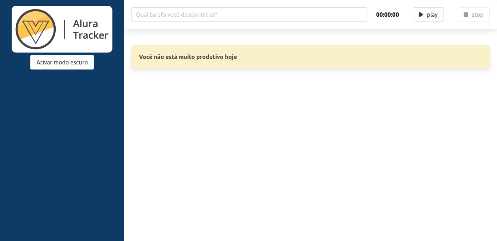

# Alura Tracker

Esse é um projeto desenvolvido  durante o curso da alura Vue3: explorando o framework, que passa toda base introdutória do vue e suas funcionalidades.

## Link do Projeto
[Para acessar o link do projeto clique aqui](https://alura-tracker-teal-ten.vercel.app/)

## Tecnologias Utilizadas

-Vue3

## Instalação 

- Utilize o `npm install` para instalar as dependências do projeto
